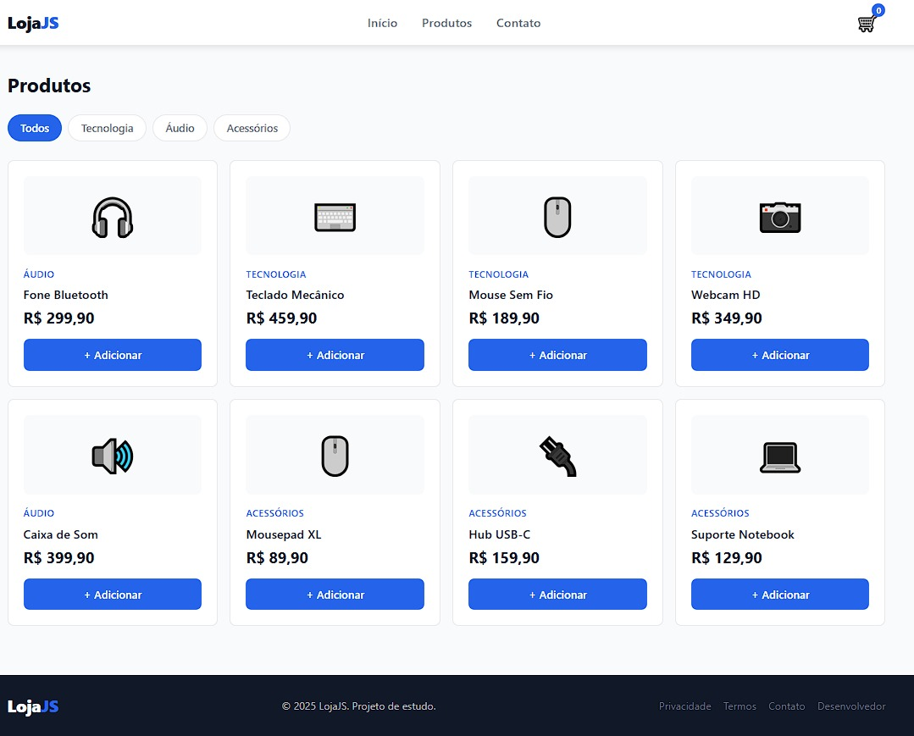

# 🛒 LojaJS

Uma aplicação de e-commerce fictícia desenvolvida com **HTML, CSS e JavaScript Vanilla**, criada com o objetivo principal de praticar conceitos fundamentais e intermediários de JavaScript através da construção de funcionalidades comuns encontradas em lojas virtuais.

## 📖 Sobre o Projeto

A LojaJS foi desenvolvida como um projeto de estudos para consolidar conhecimentos em JavaScript, manipulação do DOM e organização de código front-end.

Ao invés de focar apenas no visual, o projeto busca simular cenários reais de desenvolvimento, envolvendo renderização dinâmica de conteúdo, filtros de produtos, manipulação de eventos e gerenciamento de interface.

## 🌐 Live Preview

Você pode visualizar o projeto clicando aqui:

🔗 https://art-gallery-website-six.vercel.app/

---

## 📸 Pré-visualização do projeto

---

## 🚀 Funcionalidades

- Exibição dinâmica de produtos
- Sistema de filtros por categoria
- Carrinho lateral
- Controle de abertura e fechamento de elementos da interface
- Overlay para interação com modais e menus
- Layout totalmente responsivo
- Interface moderna e intuitiva

## 🧠 Conceitos Praticados

Durante o desenvolvimento deste projeto foram aplicados conceitos fundamentais de JavaScript voltados para manipulação da interface e interação do usuário.

### Manipulação do DOM

- Seleção de elementos
- Manipulação de classes CSS
- Adição e remoção de classes
- Alteração de atributos HTML
- Controle de estados visuais da interface

### Eventos

- Click Events
- Event Listeners
- Interação do usuário com elementos da página

### Funcionalidades Desenvolvidas

- Abertura e fechamento do carrinho lateral
- Controle de overlay
- Exibição e ocultação de elementos
- Sistema de filtragem de produtos
- Alteração dinâmica de classes para controlar estados da interface
- Manipulação de atributos para identificação e filtragem de conteúdo

### Boas Práticas

- Separação entre HTML, CSS e JavaScript
- Organização do código em funções reutilizáveis
- Estruturação semântica do HTML
- Desenvolvimento Mobile First

## 🎨 Tecnologias Utilizadas

- HTML5
- CSS3
- JavaScript (ES6+)

## 📱 Responsividade

O projeto foi desenvolvido utilizando a abordagem **Mobile First**, sendo adaptado para:

- Smartphones
- Tablets
- Desktops

## 🎯 Objetivos de Aprendizado

Este projeto foi criado para desenvolver habilidades em:

- Manipulação do DOM
- Lógica de programação
- Estruturas de dados
- JavaScript moderno
- Desenvolvimento de interfaces interativas
- Responsividade
- Organização de projetos Front-End

## 🔮 Próximas Melhorias

- Persistência do carrinho utilizando Local Storage
- Busca de produtos
- Ordenação por preço
- Integração com API de produtos
- Página individual de produto
- Sistema de favoritos

## 👨‍💻 Autor

Desenvolvido como projeto de estudo para aprimorar conhecimentos em desenvolvimento Front-End utilizando HTML, CSS e JavaScript.

Desenvolvido por **Gabriel Alves**

GitHub: https://github.com/gabriel707alves
LinkedIn: https://linkedin.com/in/gabriel707alves
